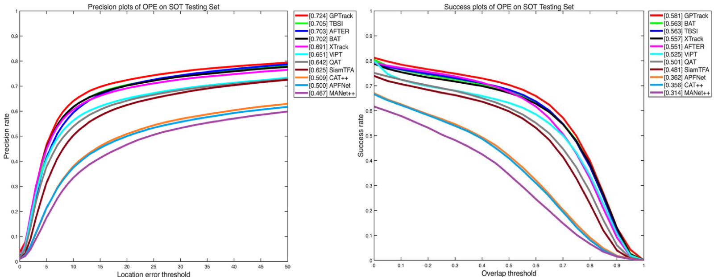

# GPTrack

## LasHeR Result Comparison

The following OPE curves compare GPTrack with representative RGB-T trackers on the LasHeR testing set.



[View the original PDF](assets/lasher_curve.pdf)

## Highlights

- **Geometry-Saliency Cross-Attention (GSCA):** Integrates imaging-inspired guidance into cross-modal interaction.
- **Multi-Relation Topology Graph (MRTG):** Builds spatial, cross-modal, and semantic edges for graph-enhanced RGB-T representation learning.
- **LasHeR-ready Training and Evaluation:** Provides experiment configs and scripts for RGB-T tracking workflows.

## Repository Structure

```text
GPTrack/
├── assets/                    # README figures and result curves
├── experiments/gptrack/       # Training and evaluation configs
├── lib/
│   ├── config/gptrack/        # GPTrack configuration
│   ├── models/gptrack/        # Model builder and tracking utilities
│   ├── train/                 # Training actors, datasets, and trainers
│   └── test/                  # Evaluation datasets and tracker wrappers
├── pretrained_models/         # Local pretrained weights
└── tracking/                  # Training, testing, and analysis entry points
```

## Installation

```bash
conda create -n gptrack python=3.8
conda activate gptrack
bash install.sh
```

## Path Setup

Initialize local paths for datasets, checkpoints, and results:

```bash
python tracking/create_default_local_file.py \
  --workspace_dir . \
  --data_dir ./data \
  --save_dir ./output
```

You can further customize paths in:

```text
lib/train/admin/local.py
lib/test/evaluation/local.py
```

## Data Preparation

Place RGB-T datasets under `./data`. For LasHeR, the expected layout is:

```text
data/
└── lasher/
    ├── trainingset/
    ├── testingset/
    ├── trainingsetList.txt
    └── testingsetList.txt
```

## Pretrained Weights

Place pretrained weights under:

```text
pretrained_models/
```

The default configs expect SOT/ViT initialization weights to be available locally.

## Training

Train GPTrack on LasHeR:

```bash
python tracking/train.py \
  --script gptrack \
  --config vitb_256_gptrack_32x1_1e4_lasher_15ep_sot \
  --save_dir ./output/vitb_256_gptrack_32x1_1e4_lasher_15ep_sot \
  --mode multiple \
  --nproc_per_node 4
```

Available experiment configs are stored in:

```text
experiments/gptrack/
```

## Evaluation

Run tracking on the LasHeR test split:

```bash
python tracking/test.py \
  gptrack \
  vitb_256_gptrack_32x1_1e4_lasher_15ep_sot \
  --dataset_name lasher_test \
  --threads 6 \
  --num_gpus 1
```

Analyze tracking results:

```bash
python tracking/analysis_results.py \
  --tracker_name gptrack \
  --tracker_param vitb_256_gptrack_32x1_1e4_lasher_15ep_sot \
  --dataset_name lasher_test
```

## Core Components

- `lib/models/gptrack/gptrack.py`: GPTrack model builder and tracking wrapper.
- `lib/models/gptrack/utils.py`: token conversion utilities and multi-relation edge construction.
- `experiments/gptrack/`: configuration files for training and evaluation.

## Maintainer

Yutong Li

## Citation

If GPTrack is useful for your research, please cite the related work and this repository.
